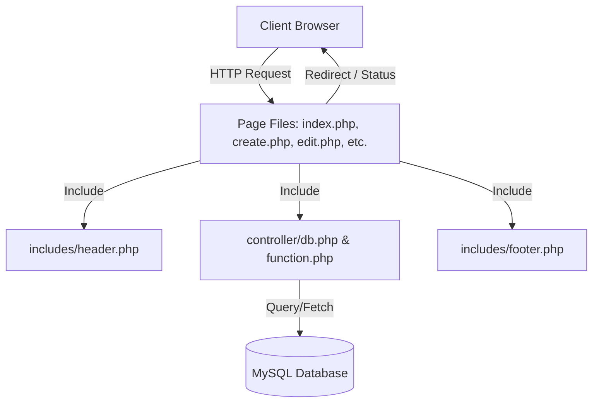
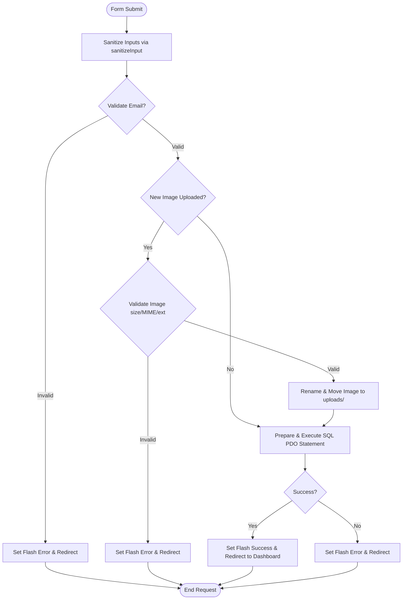

# PHP User Profile CRUD System - Full Development Plan

This document provides a comprehensive, step-by-step implementation plan for building the **User Profile Management System** using PHP (PDO), MySQL, Bootstrap 5, Summernote, and SweetAlert2.

---

## 1. System Architecture & Flow

The application follows a modular structure that separates database connectivity, helper functions, page layouts, and page-specific logic.

### 1.1 Request-Response Lifecycle Flow


### 1.2 Form Submission & Validation Flow (Store/Update)


---

## 2. Directory Structure Setup

The project will be organized as follows. All folders and placeholder files must be created initially to ensure a smooth development cycle.

```text
project-root/
│
├── assets/
│   ├── css/
│   │   └── style.css            # Custom layout tweaks (profile cards, transitions)
│   ├── js/
│   │   └── custom.js            # SweetAlert2 bindings & helper scripts
│   └── uploads/
│       └── profile_images/      # Destination folder for uploaded images
│
├── controller/
│   ├── db.php                   # Secure PDO Database connection
│   ├── function.php             # Core utility & validation functions
│
├── includes/
│   ├── header.php               # HTML Head, Bootstrap CSS, Navigation, Flash Messages
│   └── footer.php               # JS CDNs (jQuery, Bootstrap, Summernote, SweetAlert2), HTML Close
│
├── index.php                    # Landing page / Redirect to dashboard.php
├── create.php                   # User registration form UI
├── store.php                    # Action file: processes creation form submissions
├── dashboard.php                # List of all user profiles (Table view)
├── profile.php                  # Detailed single user profile view page
├── edit.php                     # Edit user profile form UI
├── update.php                   # Action file: processes update form submissions
├── delete.php                   # Action file: handles record deletion
│
├── database.sql                 # SQL schema file
└── README.md                    # Project overview and installation guide
```

---

## 3. Database Schema

### 3.1 Database Name
`user_management`

### 3.2 SQL Setup Script (`database.sql`)
```sql
CREATE DATABASE IF NOT EXISTS user_management CHARACTER SET utf8mb4 COLLATE utf8mb4_unicode_ci;
USE user_management;

CREATE TABLE IF NOT EXISTS users (
    id INT AUTO_INCREMENT PRIMARY KEY,
    name VARCHAR(100) NOT NULL,
    email VARCHAR(150) NOT NULL UNIQUE,
    description LONGTEXT NULL,
    experience LONGTEXT NULL,
    projects LONGTEXT NULL,
    profile_image VARCHAR(255) NULL,
    created_at TIMESTAMP DEFAULT CURRENT_TIMESTAMP,
    updated_at TIMESTAMP DEFAULT CURRENT_TIMESTAMP ON UPDATE CURRENT_TIMESTAMP
) ENGINE=InnoDB;
```

---

## 4. Detailed Component Design & Specifications

### 4.1 Database Configuration (`controller/db.php`)
Establishes a connection to MySQL using PHP Data Objects (PDO) with strict error handling.

- **Host**: `localhost`
- **Username**: `root`
- **Password**: `""` (default XAMPP password, empty)
- **Database**: `user_management`
- **Configuration parameters**:
  - `PDO::ATTR_ERRMODE => PDO::ERRMODE_EXCEPTION`: Throws PDOExceptions for connection/query errors.
  - `PDO::ATTR_DEFAULT_FETCH_MODE => PDO::FETCH_ASSOC`: Fetches rows as associative arrays.
  - `PDO::MYSQL_ATTR_INIT_COMMAND => "SET NAMES utf8mb4"`: Ensures full Unicode support.

### 4.2 Utility Functions (`controller/function.php`)
Provides utility operations to protect the system and abstract general tasks.

| Function | Signature | Purpose / Implementation Details |
| :--- | :--- | :--- |
| **sanitizeInput** | `sanitizeInput($data): string` | 1. `trim($data)` to remove leading/trailing spaces.<br>2. `stripslashes($data)` to remove extra backslashes.<br>3. `htmlspecialchars($data, ENT_QUOTES, 'UTF-8')` to prevent XSS. |
| **validateEmail** | `validateEmail($email): bool` | Uses `filter_var($email, FILTER_VALIDATE_EMAIL)`. Returns true if valid. |
| **validateImage** | `validateImage($file, &$error): bool` | Checks:<br>1. Check upload error codes (`$file['error']`).<br>2. Size: Max 2MB limit (`$file['size'] <= 2 * 1024 * 1024`).<br>3. Allowed Extensions: `jpg`, `jpeg`, `png`, `webp`. (using `pathinfo`).<br>4. MIME Type validation: `image/jpeg`, `image/png`, `image/webp` (using `mime_content_type`). |
| **uploadImage** | `uploadImage($file): string` | Generates a unique name: `uniqid('img_', true) . '.' . $extension`. Moves file to `assets/uploads/profile_images/` and returns the file path (or relative path to save in DB). |
| **setFlash** | `setFlash($type, $msg): void` | Sets `$_SESSION['flash'][$type] = $msg`. |
| **getFlash** | `getFlash($type): ?string` | Retrieves and immediately deletes `$_SESSION['flash'][$type]` to prevent display on next refresh. |

### 4.3 Layout Templates

#### `includes/header.php`
- Starts PHP session (`session_start()`).
- Links to Bootstrap 5 CSS CDN (`https://cdn.jsdelivr.net/npm/bootstrap@5.3.0/dist/css/bootstrap.min.css`).
- Navigation bar containing links to **Dashboard** and **Add Profile**.
- Custom CSS stylesheet link (`assets/css/style.css`).
- Global Flash Message renderer container.
- Opens the main layout bootstrap container: `<div class="container my-5">`.

#### `includes/footer.php`
- Closes the bootstrap container: `</div>`.
- Includes jQuery CDN (required for Summernote): `https://code.jquery.com/jquery-3.6.0.min.js`.
- Includes Bootstrap 5 Bundle JS CDN.
- Includes Summernote WYSIWYG Editor JS and CSS CDNs.
- Includes SweetAlert2 CDN (`https://cdn.jsdelivr.net/npm/sweetalert2@11`).
- Custom JavaScript link (`assets/js/custom.js`).
- Initializes Summernote on textareas:
  ```javascript
  $(document).ready(function() {
      $('.summernote').summernote({
          placeholder: 'Write details here...',
          tabsize: 2,
          height: 180,
          toolbar: [
              ['style', ['style']],
              ['font', ['bold', 'underline', 'clear']],
              ['color', ['color']],
              ['para', ['ul', 'ol', 'paragraph']],
              ['table', ['table']],
              ['insert', ['link']],
              ['view', ['fullscreen', 'codeview', 'help']]
          ]
      });
  });
  ```

---

## 5. Page-by-Page Logic Specifications

### 5.1 Registration Page (`create.php`)
- Standard HTML form with `method="POST"` and `enctype="multipart/form-data"`.
- Inputs:
  - Name (text, required)
  - Email (email, required)
  - Profile Image (file, optional/required depending on setup - recommended optional with default image fallback)
  - Description (textarea with class `summernote`)
  - Experience (textarea with class `summernote`)
  - Projects (textarea with class `summernote`)

### 5.2 Store Logic (`store.php`)
- Process POST requests only.
- Include `controller/db.php` and `controller/function.php`.
- Perform checks:
  1. Sanitization of input fields.
  2. Validation of required inputs (Name, Email).
  3. Validate that Email doesn't already exist in the database.
  4. Validate profile image (if uploaded).
  5. Handle profile image upload to `assets/uploads/profile_images/`. If no image is uploaded, use a placeholder or default image string.
- Database Execution:
  ```sql
  INSERT INTO users (name, email, description, experience, projects, profile_image) 
  VALUES (:name, :email, :description, :experience, :projects, :profile_image);
  ```
- Redirect: Set success flash message and redirect to `dashboard.php`. If validation fails, set error flash message and redirect back to `create.php` (retaining inputs via session can be added if desired).

### 5.3 Dashboard (`dashboard.php`)
- Displays all profiles in a clean Bootstrap 5 data table.
- columns:
  - **Profile Image**: Rendered inside a circular thumbnail `50x50` px.
  - **Name**: Text.
  - **Email**: Text.
  - **Created Date**: Formatted date (`d M Y, h:i A`).
  - **Actions**:
    - **View**: Green info button pointing to `profile.php?id={id}`.
    - **Edit**: Blue warning button pointing to `edit.php?id={id}`.
    - **Delete**: Red danger button triggering the SweetAlert2 popup.

### 5.4 Profile View (`profile.php`)
- URL format: `profile.php?id={id}`.
- Sanitizes and validates the incoming query parameter `id` (must be numeric and exist).
- Displays detailed grid layout:
  - Left side: Circular profile photo, name, email.
  - Right side: Tabs or stacked cards for **Description**, **Experience**, and **Projects** (preserving HTML output from Summernote safely by rendering them).

### 5.5 Edit Page (`edit.php`)
- URL format: `edit.php?id={id}`.
- Fetches existing user data from database and displays standard form with prefilled inputs.
- Shows current profile photo preview.
- Includes hidden input field: `<input type="hidden" name="id" value="<?= $user['id']; ?>">`.

### 5.6 Update Logic (`update.php`)
- Process POST requests only.
- Compare incoming data:
  1. Validate ID exists and is valid.
  2. Validate and sanitize inputs.
  3. Check if a new profile image is uploaded.
     - **If yes**: Validate the new image, delete the old file from `assets/uploads/profile_images/`, upload the new image, and set the new image path for the database.
     - **If no**: Keep the existing image path in the database.
- Database Execution:
  ```sql
  UPDATE users 
  SET name = :name, email = :email, description = :description, 
      experience = :experience, projects = :projects, profile_image = :profile_image 
  WHERE id = :id;
  ```
- Redirect: Set success flash message and redirect to `dashboard.php`.

### 5.7 Delete Logic (`delete.php`)
- Accept POST or GET request (recommended POST with CSRF check, or a simple GET with a SweetAlert confirmation redirect).
- Steps:
  1. Retrieve `id` from parameter.
  2. Query database for user info to find the file path of their `profile_image`.
  3. Delete the profile image file using `unlink()` from the server storage if it exists and is not a default placeholder.
  4. Delete database row:
     ```sql
     DELETE FROM users WHERE id = :id;
     ```
  5. Set success flash message.
  6. Redirect to `dashboard.php`.

---

## 6. SweetAlert2 Delete Confirmation Integration

To prevent accidental data loss, the Delete button in `dashboard.php` triggers SweetAlert2.

### 6.1 JavaScript Implementation (`assets/js/custom.js`)
```javascript
$(document).ready(function () {
    // Select delete button triggers
    $('.btn-delete-user').on('click', function (e) {
        e.preventDefault();
        const deleteUrl = $(this).attr('href');
        
        Swal.fire({
            title: 'Are you sure?',
            text: "This action will permanently delete the user profile and their image!",
            icon: 'warning',
            showCancelButton: true,
            confirmButtonColor: '#d33',
            cancelButtonColor: '#3085d6',
            confirmButtonText: 'Yes, delete it!',
            cancelButtonText: 'Cancel'
        }).then((result) => {
            if (result.isConfirmed) {
                // Redirect to delete.php?id={id}
                window.location.href = deleteUrl;
            }
        });
    });
});
```

---

## 7. Security Implementation Rules

1. **SQL Injection Prevention**:
   - Every database query must use PDO Prepared Statements. No SQL string concatenation with user inputs.
   - Example:
     ```php
     $stmt = $pdo->prepare("SELECT * FROM users WHERE email = :email");
     $stmt->execute(['email' => $email]);
     ```
2. **Cross-Site Scripting (XSS) Prevention**:
   - Run `sanitizeInput` on inputs before processing.
   - For regular output (Name, Email), run `htmlspecialchars()` before displaying in HTML.
   - For Summernote HTML output (Description, Experience, Projects), filter the HTML if needed, or render carefully since it contains rich formatting. (Ensure raw scripts `<script>` tags are sanitized or stripped out using libraries/custom logic if arbitrary scripts could be pasted).
3. **Secure File Uploads**:
   - Do not trust the user-supplied filename (`$_FILES['image']['name']`).
   - Use `mime_content_type()` to confirm actual file types rather than just relying on extensions.
   - Restrict extensions strictly to `jpg`, `jpeg`, `png`, `webp`.
   - Rename files using cryptographically secure values or unique hashes (e.g., `md5(uniqid())`) to prevent execution of files named `shell.php.jpg`.

---

## 8. Development Schedule & Checklist

### Phase 1: Infrastructure & DB Setup
- [ ] Install Apache & MySQL. Create `user_management` database.
- [ ] Set up the folder structures in the project workspace.
- [ ] Create `database.sql` and run it in PHPMyAdmin/MySQL client.
- [ ] Implement `controller/db.php` (PDO instance setup).
- [ ] Implement validation & helper functions in `controller/function.php`.

### Phase 2: Page Layout & Add Profile
- [ ] Set up templates: `includes/header.php` and `includes/footer.php`.
- [ ] Design custom dashboard stylesheet: `assets/css/style.css`.
- [ ] Create registration page `create.php` with Summernote integrated.
- [ ] Build form processor `store.php` with file-upload validation.

### Phase 3: Dashboard & View Actions
- [ ] Create `dashboard.php` pulling data from DB into a responsive table.
- [ ] Create `profile.php` displaying full details in structured card layouts.
- [ ] Implement SweetAlert2 confirm script inside `assets/js/custom.js`.

### Phase 4: Editing & Deleting Logic
- [ ] Create `edit.php` prefilling existing data and rendering the current profile image.
- [ ] Implement `update.php` logic to replace/preserve files and update database entries.
- [ ] Create `delete.php` to clean up profile assets from disk and clear DB rows.

### Phase 5: Verification & Testing
- [ ] Test with zero records (dashboard displays correct "No records found" fallback).
- [ ] Test file size limits and disallowed extensions (e.g. attempting to upload `.txt` or `.exe`).
- [ ] Confirm image files are properly unlinked from the server storage on deletion.
- [ ] Verify HTML rich formatting renders correctly without raw HTML tags visible to the user.
